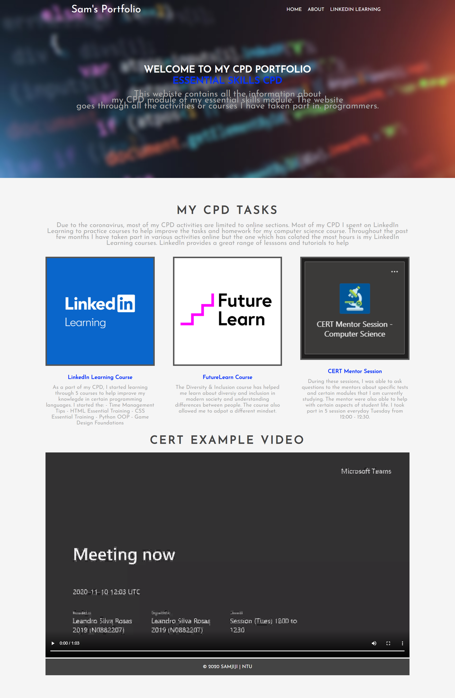

<div id="top"></div>
<br />

## Basic Website | About The Project

This website was created as a part of my computer science module, where I studied the basics of HTML & CSS. The website is used to show my CV information which is used to showcase my modules and the programming languages I have used.


## Website Screenshot




### Built With

This section should list any major frameworks/libraries used:

* [HTML](https://developer.mozilla.org/en-US/docs/Web/HTML)
* [CSS](https://www.w3.org/Style/CSS/Overview.en.html)

### Running Webiste

As the website is stored locally any user who wishes to view the webpages you have to open the index file.

* open the html file
  ```sh
  index.html
  ```


<!-- ROADMAP -->
## Roadmap

- [x] Add HTML File
- [x] Add CSS Files
- [] Add Javascript
- [] Add Login System/Backend Database
- [] Multi-language Support

© Sam Jiji


